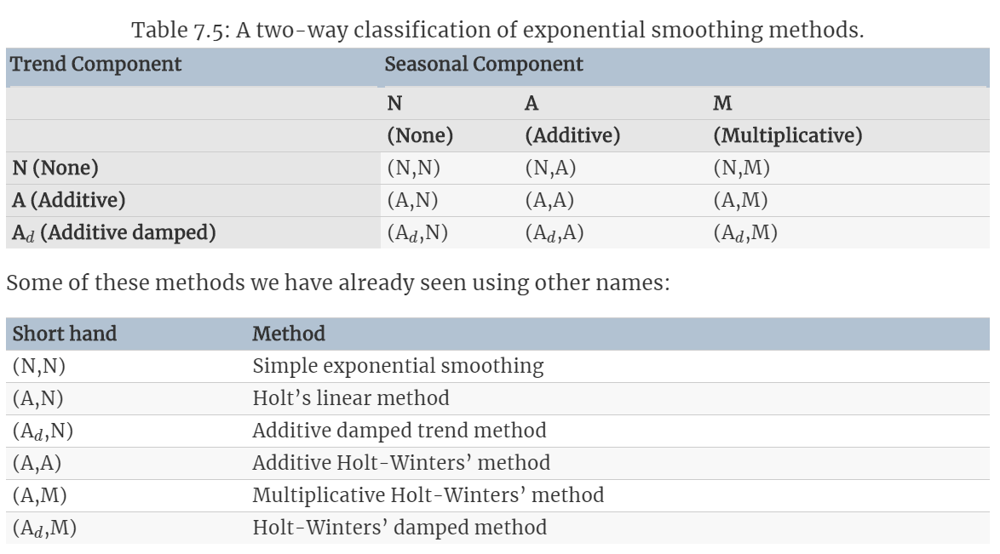
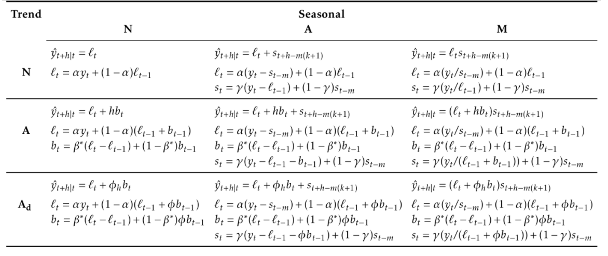
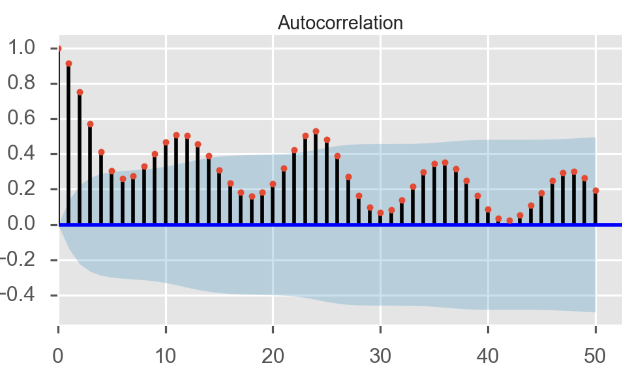
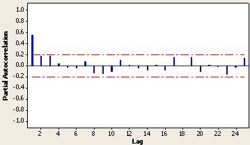

# Forecasting  

This repository is intended to be a recopilaton of different techniques and models that you can perform while forecasting an univariate time series using both Python libraries and R packages together, the section D `Theory` is intented to be a compilation of the theory behind forecasting. From **autoregressive models** (`Simple Exponential Smoothing`, `Holt`, `Holt-Winters` or `Arima`), **ensemble trees** (`Ada Boost`, `Gradient Boosting`, `Random Forest`, `XGBoost`) and **neural networks** (LSTM, CNN). Additionaly, you can perform **outlier detection**, **interpolation** and **structural change tests** based on R packages like `tsoutliers` and `strucchange`. There is the option to implement the **tasks in parallel**, check section F `Parallel Computation`. Finally, for **setting up a virtual environment with R and Python** checkout the setting up instrucions under the `setup` folder.  


> NOTE. To visualize the TeX code, activate the [MathJax](https://chrome.google.com/webstore/detail/mathjax-plugin-for-github/ioemnmodlmafdkllaclgeombjnmnbima) plugin for Github.

***

## A. Exponential Smoothing Models

This methods produce forecasts by weighting average of past observations, this weights decay exponentially as the observations get older. To select between `Simple Exponential Smoothing`, `Holt` or `Holt-Winters` one must be able to recognise the component of the time series (see section D) and the way this components interact with the smoothing method (additive, damped or multiplicative). the image below shows the appropiate model selection based on these conditions, image is taken from chapter 7 of [10].



> **A.1 Simple Exponential Smoothing**

When there is no clear trend or seasonality this model is ideal. It works under assumption of giving less weigth to distant observations through a parameter $\alpha \in [0,1]$ and the following expression


$$\hat{y}_{t+1|t} = \alpha y_{t} + \alpha(1-\alpha)y_{t-1} + \alpha(1-\alpha)^2y_{t-2} + ...,$$

notice the decay in the coefficient associated to each $y_{t-k}$, the more distant the observation the larger the value $\alpha(1-\alpha)^k$, thus, the less weight the value $y_{t-k}$ takes.

One can choose the right $\alpha$ value by minimizng the `SSE` or sum of squared residuals 

$$SSE = \sum_{t=1}^{L}(y_{t} - \hat{y}_{t|t-1})^2.$$

> **A.2 Holt Linear Trend Method**

To forecast data with trend, we now include two smoothing equations

$$\hat{y}_{t+h|t} = l_{t} + hb_{t}, $$

$$\text{Level equation} \:\: l_{t} = \alpha y_{t} + (1-\alpha)(l_{t-1} + b_{t-1}),$$

$$\text{Trend equation} \:\: b_{t} = \beta^* (l_{t} - l_{t-1}) + (1-\beta^*)b_{t-1},$$

where $\alpha \in [0,1]$ is the smoothing parameter for the level
and $\beta^* \in [0,1]$ is the smoothing parameter for the trend. Notice that the level equation is weighted average between the past observation $y_{t}}$ and the first equation. By contrast, the trend equation is a weighted average between the difference in the level equation and the previous trend equation. 

In addition, one can also **dampen the trend** to a flat line. To control this behavior the damping parameter $\phi \in [0,1]$ is included. Thus,  

$$\hat{y}_{t+h|t} = l_{t} + (\phi + \phi^2 + ... + \phi^h)b_{t}, $$

$$l_{t} = \alpha y_{t} + (1-\alpha)(l_{t-1} + \phi b_{t-1}),$$

$$b_{t} = \beta^* (l_{t} - l_{t-1}) + (1-\beta^*)\phi b_{t-1},$$

one can easily see that the dumping parameter is only affecting the trend component. So, an effective damped model would consider $0.8\leq \phi < 1$ because $\phi$ has a strong effect for smaller values. 

> **A.3 Holt-Winters Seasonal method**

This method extends the  Holt model to capture seasonality by additionally incorporating a smoothing equation for the seasonal component. Depending on the nature of the seasonal component there are two variations of this method. When the seasonal variation is changing proportional to the level of the series the `multiplicative method` is choosen. Whereas, when the seasonal variations are constant through the series the `additive method` is the choice. Let's see this two methods in more detail, below the `Holt-Winters additive method`

$$\hat{y}_{t+h|t} = l_{t} + hb_{t} + s_{t+h-m(k+1)}, $$

$$l_{t} = \alpha(y_{t} - s_{t-m}) + (1-\alpha)(l_{t-1} + b_{t-1}),$$

$$b_{t} = \beta^* (l_{t} - l_{t-1}) + (1-\beta^*)b_{t-1},$$

$$s_{t} = \gamma(y_{t}-l_{t-1}-b_{t-1}) + (1-\gamma)s_{t-m},$$

where $m$ denotes the frequency of the seasonality ($m$=12 for monthly data, 
$m$=4 for quarterly, $m$=52 for weekly data and $m=7$ for daily data) and $\gamma \in [0, 1-\alpha]$. Note that the seasonal equation is a weighted average between the current season and the same season of $m$ periods ago. In the multiplicative case, the series is seasonally adjusted by dividing through the seasonal component. 

$$\hat{y}_{t+h|t} = (l_{t} + hb_{t}) s_{t+h-m(k+1)}, $$

$$l_{t} = \alpha\dfrac{y_{t}}{s_{t-m}} + (1-\alpha)(l_{t-1} + b_{t-1}),$$

$$b_{t} = \beta^* (l_{t} - l_{t-1}) + (1-\beta^*)b_{t-1},$$

$$s_{t} = \gamma\dfrac{y_{t}}{l_{t-1}-b_{t-1}} + (1-\gamma)s_{t-m}.$$

It is also possible to consider damped versions of this models, check out [10] for more details. A summary of this models is provided in the image below, again taken from [10]



Finally, the models `sem`, `holt` and `holt-winters` under the `AutoRegressiveModels.py` file use a grid search to fit the best parameters to each model.  

***

## B. Understanding the ARIMA model

$ARIMA$ stands for autoregressive integrated moving average. But, what does it mean autoregressive or moving average? Basically, it depends on the term that you're considering to forecast the variable of interest. For example, if you're considering the prior observation $y_{t-1}, y_{t-2}, ...$ it is autoregressive and if you're taking into account the forecast errors $\epsilon_{t}, \epsilon_{t-1},...$ it is moving average. 

> **B.1 The autoregressive part**

Autoregression means a regression of the variable against itself, in other words, we forecast the variable of interest $y_{t}$ by taking a linear combination of past values 

$$y_{t} = c + \phi_{1}y_{t-1} + \phi_{2}y_{t-2} + ... + \phi_{p}y_{t-p} + \epsilon_{t},$$

where $c$ is a constant and $\epsilon_{t}$ is white noise. We can refer to this model as an autoregressive model of order $p$ or $AR(p)$ model.

> **B.2 The Movingaverage part**

If we now consider the prior errors of the forecast we have 

$$y_{t} = c + \epsilon_{t} + \alpha_{1}\epsilon_{t-1} + ... + \alpha_{q}\epsilon_{t-q},$$

where $\epsilon_{t}$ is white noise. We can refer to this model as moving average model of order $q$ or $AR(q)$ model.

> **B.3 The non-seasonal $ARIMA$ model**

An $ARIMA$ model is expressed as 

$$y_{t}' = c + \phi_{1}y_{t-1}' + ... + \phi_{p}y_{t-p}' + \alpha_{1}\epsilon_{t-1} + ... + \alpha_{q}\epsilon_{t-q} + \epsilon_{t},$$

where $y_{t}'$ is the degree of differencing in the series, if it is one time is $y_{t}'$ and if it is second time is $y_{t}''$. Therefore when combining the autoregression, the moving average and the differencing we obtain a non-seasonal $ARIMA(p,d,q)$ model, where $p$ is the order or the autoregressive part, $d$ the degree of first differencing and $q$ the order of the moving average part.

***

## C. Decision Tree Models

First, the data is transformed with the function ```window_slide```. This is done, in order to be able to forecast when calling the ```predict``` method of each model, that is, for constructing the variable $y_{t+1}$ we consider n past observations $y_{t+1} = y_{t} + y_{t-1} + ... + y_{t-n+1}$. Then, call the desired model (```'rfr'``` for RandomForest, ```'gbr'``` for GradientBoosting, ```'adr'``` for AdaBoost and ```'xgbr'``` for XG-Boost) with the function ```tree_model```. Finally, the parameters of each model where choosen according to [3].

---

## D. Neural Networks

Currently it implements a stacked LSTM. To specify an LSTM specify `model == 'Stacked-LSTM'` when calling the function `nn_model` of the class `NeuralNetworks`. Furthermore, you can specify the number of stacked layers and units by setting the integer parameters `layers` and `units` respectively, for example, if you set `layers=4` and `units=8` each layer will have (units / number of hidden layer) as units.  

---

## D. Theory

> **A. Components of a Time Series**

A Time Series has three basic components, which are helpful to understand to identify appropiately a forecasting method that is capable of capturing the patterns of the time series data.

1. **Trend**. They are up or down changes (steep upward slope, plateauing downward slope).
2. **Seasonality**. The effect on the time series by the season (measured by time).
3. **Noise**. Is the random variation in the series and it is composed of:
   *   White Noise. If the variables are independent and identically distributed with a mean of zero. This means that all variables have the same variance ($\sigma^2$) and each value has a zero correlation with all other values in the series. See [6] for more details. In other words, the series shows no autocorrelation.
   *   Random Walk. A random walk is another time series model where the current observation is equal to the previous observation with a random step up or down. Checkout [7].

4. **Cycles**. It happens when the time series exhibits rises and fall that aren't of fixed frequency. It is not important not to confuse this concept with seasonality. When the frequency is unchanging and associated with some calendar date then there is seasonality. On the other hand, the fluctuations are cyclic when there are not of a fixed frequency. 

> **B. Methods to decompose a Time Series**

A Time series $y_{t}$ can be expressed by the components mentioned before as a sum (`additive`)

$$y_{t} = S_{t} + T_{t} + R_{t}$$

or as a multiplication (`multiplicative`)

$$y_{t} = S_{t} \times T_{t} \times R_{t},$$

where $S_{t}$ is the `seasonal component`, $T_{t}$ the `trend component` and $R_{t}$ the `remainder component` at time $t$.
But, how can we choose which decomposition is suitable for the time series? When the variation in the seasonal pattern is proportional to the level (average value of the series)  of the time series choose the **multiplicative decomposition**. On the other hand, if the seasonal fluctuations do not vary with the level of the time series choose the **additive decomposition**. 

**B.1 Classical Decomposition**

One strong assumption of this method is that the seasonal component is constant from year to year. The procedure for **Additive Decomposition** is 

> 1. Compute the Trend-Cycle component $\hat{T_{t}}$ with a moving average MA process. If the period $m$ is an odd number use an $m-MA$ other wise an $2\times m-MA$.
> 2. Detrend the series $y_{t} - \hat{T_{t}}$.
> 3. Estimate the seasonal component $\hat{S_{t}}$ for each season by averaging the detrended values for each season. 
> 4. Calculate the remainder component $\hat{R_{t}} = y_{t} - \hat{T_{t}} - \hat{S_{t}}.$

For the **Multiplicative decomposition** the steps are similar, but now consider

 $$y_{t}/\hat{T_{t}}$$ 
 
 in step 2 and 
 
 $$\hat{R_{t}} = y_{t}/(\hat{T_{t}} \hat{S_{t}})$$

 to estimate the remainder. As we said before, the strong assumption of this method (seasonal components repeats every year) it is not reasonable for larger time series because the behavior of the data could change. For example, consider the increasing consumption of mobile devices.


**B.1 STL Decomposition**

STL stands for Seasonal and Trend decomposition using Loess. There are two main advantages of this method it can handle any type of seasonality and it can be robust to outliers. In other words, unusual observations will not affect the trend-cycle and seasonal component estimation (the remainder component is indeed affected). 

To choose between a `multiplicative` or `additive` decomposition one should assess the $\lambda$ value of the Box-Cox transformation. That is, if $\lambda = 0$ choose a multiplicative decomposition, otherwise when $\lambda \approx 1$ the additive decomposition is better. 

One can implement it in R with the `stl` function of the `stats` library or from the `statsmodels` package in Python.


> **C. Autocorrelation**

Autocorrelation measure the **linear relationship between lagged values** in a time series. The autocorrelation coefficient is given by the formula 

$$r_{k} = \dfrac{\sum_{t=k+1}^{L}(y_{t}-\overline{y})(y_{t-k}-\overline{y})}{\sum_{t=1}^{L}(y_{t}-\overline{y})^2}, $$

in other words $r_{1}$ measure the relationship between $y_{t}$ and $y_{t-1}$ and so with $r_{2}, r_{3},...r_{L-1}$.

These coefficients are plot to show the autocorrelation function or `ACF`.

> **D. Interpreting the ACF and PACF plot**

The ACF plot allow us to identify trend, seasonality or a mixture of the both in the time series.

 When data have trend, the autocorrelation for the first lags is large and positive (the nearer the data in time the similar they'll be in size/value) and it slowly decrease as the lag increase. By contrast, when the data is seasonal we will see larger values appear every certain lag, that is, the autocorrelation is largeer at multiples of the seasonal frequency than  other lag values. Finally, when data is both trended and seasonal, it is likely to see a combination of these effects. The above image, taken from [9], shows an example of this behavior  

 

 The partial autocorrelation is used to measure the relationship between an actual observation $y_{t}$ and a prior observation $y_{t-k}$ after removing the effects of the lags $1,2,3,...,k-1$.

  

***D.1 Choosing an ARIMA model based on the ACF and PACF***

The ACF and PACF are useful to determine the $p$ and $q$ value of an $ARIMA$ model when the data comes from an $ARIMA(p,d,0)$ or an $ARIMA(0,d,q)$ model. In the first case, the data follow an $ARIMA(p,d,0)$ when 

* The $ACF$ is exponentially decaying or sinusoidal 

* There is a significant spike at lag $p$ in the $PACF$, but none beyond lag $p$.

and an $ARIMA(0,d,q)$ when this behavior is inversed, that is 

* The $PACF$ is exponentially decaying or sinuosoidal,

* There is a significant spike at lag $q$ in the $ACF$, but none beyond lag $q$.

Note that when $p$ and $q$ are both positive, then these plots are not helpful in for finding the values of p and q. 

> **E. Statistical tests for autocorrelation**

We would like to test the different $r_{k}$ coefficients. But doing multiple single test could yield a false positive, in other words, we could get to conclude that there is autocorrelation in the residuals when that is not true. We could overcome this with a `Portmanteau test` setting the null hypothesis as following 

$$H_{0} = \text{Autocorrelations come from a white noise.}$$

One such test is the `Ljung-Box test`

$$Q= L(L+2)\sum_{k=1}^h (L-k)^{-1} \: r_{k}^2,$$

where $h$ is the maximum lag considered. Thus, a large value of $Q$ implies that the autocorrelations do not come from a white noise series. Another test that can be considered is the `Breusch-Godfrey` test, both of them are implemented in the function `checkresiduals()` of the `forecast` R package. 

---

> **F. Why it is important to difference a Time Series ?**

A Time Series is stationary if it's properties do not depend on time, that is, it's properties do not change in time. But, what are the properties of a time series? Basically we could consider two main components: it's mean $\mu$ and it's variance $\sigma^2$. Thus, it is natural to think that time series with trends or with seasonality are not stationary because when the values increases so the mean and when there is seasonality the values in a given period depend on the time period.

Now, how could one control the $\mu$ and the $\sigma^2$ of a time series? Remember that a logarithmic transformation smooth values. For example, on a normal scale two is 48 units away from fifty, but in logarithmic scale they are just 3.2 units aways. Therefore, to stabilise the variance the logarithmic transformation is helpful. 

Regarding the mean, think about what is happening when you have an upward/downward trend? The value at a future time $y_{t+1}$ is greater/lower than the current value $y_{t}$. Thus, if we substract the actual value from the future value $y_{t+1} - y_{t}$ we remove the change in the level of the time series, in this way we help stabilise the mean. This procedure is called differencing and it also applies to seasons, that is, 

$$y_{t}' = y_{t} - y_{t-m}$$

where $m$ is the number of seasons or the lag $m$ because we substract the observation after a lag of $m$ periods. In R, the functions `ndiffs` and `nsdiffs` let you determine the number of first differences and seasonal differences to apply respectively. `ndiffs` work by running a sequence of `KPSS` tests until the series is stationary. 


> **G. Unit Root tests** 

When dealing with time series a common task is to determine the form of the trend in the data. In this way, `Unit Root tests` are used to determine how to deal with treading data. In other words, they determine if data should be first differencing
> For example the ADF tests allow us to determine the order or integration $k$ in a process $I(k)$ by testing the null hypothesis $H_{0}$ of non-stationarity until the data is stationarity. That is, if we reject the null we first difference the time series and perform the ADF until the data is stationary.  

or regressed on deterministic functions of time to render the data stationary. To this end it is crucial to specify the null and alternative hypothesis appropriately to characterize the trend properties of the data. 

***G.1 Specifying the null and alternative hypothesis***

The trend properties of the data under the alternative hypothesis determines the form of the test regression to perform. There are two common cases:

 **Constant Trend.** This formulation is suitable **for non-trending time series**. Considering $y_{t}$ a time series and an autoregressive model with one parameter $AR(1)$, the test regression is 

$$ y_{t} = c + \phi y_{t-1} + \epsilon_{t} $$

and the corresponding hypothesis are

$$H_{0} \: : y_{t} \sim I(1) \:\: \text{without drift} \\ 
H_{1} \: : y_{t} \sim I(0) \:\: \text{with non-zero mean}
$$

where $I(k)$ is a process of integrated order $k$.


**Constant and Time trend.** 

In this case, we will incorporate a deterministic time trend parameter to the test regression to capture the deterministic trend under the alternative. 

$$y_{t} = c + \delta t + \phi y_{t-1} + \epsilon_{t}$$

The corresponding hypothesis test are 

$$H_{0} \: : y_{t} \sim I(1) \:\: \text{with drift} \\ 
H_{1} \: : y_{t} \sim I(0) \:\: \text{with deterministic trend}
$$

Thus, this formulation is appropriate **for trending time series**. 


***G.2 Augmented Dicker-Fuller Test***

The prior methods consider a simple $AR(1)$ model. In order to consider a moving average structure, that is, an ARMA structure, the ADF is based on the following test statistic.

$$y_{t} = \beta^{'}D_{t} + \phi y_{t-1} + \sum_{j=1}^{p}\psi_{j}\:\Delta y_{t-j} + \epsilon_{t},$$

where $p$ are the lagged difference terms and the **error term** $\epsilon_{t}$ **is assumed to be homoskedastic** and **[serially uncorrelated](https://www3.nd.edu/~rwilliam/stats2/l26.pdf)**.  So, the ADF test tests the null hypothesis that a time
series $y_{t}$ is $I(1)$ against the alternative that it is $I(0)$. 


***G.3 Phillips-Perron test***

The Phillips-Perron test differs from the ADF by ignoring the serial correlation in the errors and by assuming that they may be [heteroskedastic](https://en.wikipedia.org/wiki/Heteroscedasticity). The test regression is 

$$\Delta y_{t} = \beta^{'}D_{t} + \pi y_{t-1} + \epsilon_{t}$$

and compared to the ADF test, the error term $\epsilon_{t}$ is robust to general forms of heteroskedasticity.


> **H. Stationary tests**

We've seen that unit root test test the null hypothesis that the time series $y_{t}$ is $I(1)$. By contrast, stationarity tests test for the null that $y_{t}$ is $I(0)$.

First, we consider the model 

$$y_{t} = \beta^{'}D_{t} + \mu_{t} + u_{t},$$

where 

$$\mu_{t} = \mu_{t-1} + \epsilon_{t}, \: \epsilon_{t} \sim WN(0, \sigma_{\epsilon}^{2})$$

and $u_{t}$ is $I(0)$ and could be hetroskedastic. Notice that $\mu_{t}$ is a random walk with variance $\sigma_{\epsilon}^{2}$ and we would like to proof if $\mu_{t}$ is constant, that is, $\sigma_{\epsilon}^{2} = 0$. In order to do this, we consider the `KPSS test` for testing $\sigma_{\epsilon}^{2} = 0$ against the alternative $\sigma_{\epsilon}^{2} > 0$ with the statistic

$$KPSS = \bigg(L^{-2} \sum_{t=1}^{L}\hat{S_{t}^2}\bigg) / \lambda^2,$$

where $\hat{S_{t}^2} = \sum_{j=1}^{t}\hat{u_{j}}$ and $\hat{u_{j}}$ are the residuals of the regression of the time series $y_{t}$ on the deterministic components $D_{t}$. 

> **I. Model Diagnosis**

The residual is the difference between the fitted value and the real value, in mathematical terms

$$e_{t} = y_{t} - \hat{y_{t}}.$$

To check wheter a model has captured the information adequately one should check that the residuals follow the next properties:

1. `The residuals are uncorrelated`. When correlations is present it means that there is information left in the residuals which should be used in computing forecasts.

2. `The residuals have mean zero`. When the mean of the residuals is different from zero, the forecasts are biased. 

3. `The residuals have constant variance`. 

4. `The residuals are normally distributed`. 

Thus, if the residuals of a model does not satisfy these properties it can be improved. For example, to fix the bias problem one just add the mean of the residuals to all the points forecasted.

> **F. Model Comparison**

The ``Diebold-Mariano`` test allow us to compare the forecast accuracy between two models. Consider $y_{t}$ as the time series to be forecasted, $y^{1}_{t+h|t}$ and $y^{2}_{t+h|t}$ be two competing forecast on the step $t+h$ and $y_{t+h}$ the real value. Then, the forecast errors associate to this models are 

$$\epsilon_{t+h|t}^{1} = y_{t+h} - y^{1}_{t+h|t} \\ \epsilon_{t+h|t}^{2} = y_{t+h} - y^{2}_{t+h|t}$$

respectively. To determine which models predicts better than the other we may test the null hypothesis of equal predictive accuracy

$$H_{0}: E[d_{t}] = 0,$$

against the alternative 

$$H_{1}: E[d_{t}] \neq 0,$$

where $d_{t} = L(\epsilon_{t+h|t}^{1}) - L(\epsilon_{t+h|t}^{2})$ is the loss differential, for example, an squared error loss is $L(\epsilon_{t+h|t}^{i}) = (\epsilon_{t+h|t}^{i})^2$. One can easily implement this test through the [dm.test()](https://pkg.robjhyndman.com/forecast/reference/dm.test.html) function of the `forecast` package in R.

***

## E. Preprocess Data (Functions)

### E.1 Transform Data 

It implements `Penalized Mean`, `Box Cox Transform` or `Yeo-Johson` transformation to normalize data. In case you only have positive value use the `Box Cox Transform` and transform the data according to the next table

| Lambda Value | Transformation of response variable |
| -------------| ------------------------------------|
|   -3         |    y^{-3}                           |
|   -2         |    y^{-2}                           |
|   -1         |    y^{-1}                           |
|   -.5        |    y^{-.5}                          |
|    0         |    log(y)                           |
|    0.5       |    y^{.5}                           |   
|    1         |    y^1                              |  
|    2         |    y^2                              |
|    3         |    y^3                              |

In case of negative values use the `Yeo-Johnson` transformation. `Penalized Mean` is more suitable when you have high leverage points or heavy outliers. 


### E.2 Test Data

Implements an augmented `Dicker-Fuller test` (unit root) or a `KPSS-test` in order to determine which type of model to apply between `Simple Exponential Moving Average`, `Holt`, `Holt-Winters Additive` or `Seasonal Arima` from the `statsmodels` library. 

### E.3 Process Data

Through the ```rpy2``` library we call an R enviroment to use distinct statistical packages as ```strucchange```, ```TSA```, ```zoo```, ```tsoutliers```, ```pracma```, ```imputeTS``` or ```forecast```.

##### E.3.1. Interpolation.

It implements different types of interpolation such as: `NA`, `Kalman`, `Moving Average`, `Seasonal Decompose`, `Seasonal Splitted` or `StructTS`. In general, these methods are used to replace NA values in a time series. 

##### E.3.2. Outlier Detection and Replacement.

An outlier is understood as an observation that is not explained by the model, so their role in forecast is limited in the sense that the presence of new outliers will not be predicted. **Time Series data often presents outliers due to influence of non-usual events**. Forecast accuracy in such situtations is reduced due to:

* Carry-over effect of the outlier on the point forecast
* Bias in the estimatess of model parameters.

In fact, there are different kinds of outliers:

* **Additive Outlier**. They do affect only a single observation.
* **Innovative Outlier**. An unusual observation that affects all later observations.
* **Level Shift Outlier**. Abrupt and permanent step change in the series.

So as different ways of detecting them, such as:

* **Studentized Residuals / Bonferroni test**. Normally, discrepant observations have large residuals
* **F-statistic**. Test for a single shift in the series.
* **Fluctuation Tests**. Based on the cumulative sum of the residuals.

Normally, to treat this unusual observations (outliers) you could implement the following steps with the aid of the ```outlier_dectection``` and ```outlier_replacement``` functions:

1. Identify the location and presence of outliers. (```outlier_dectection``` detects outliers applying the locate_outliers function from the tsoutliers package or detectAO from the TSA package).

2. Omit the outliers and do interpolation, for example, through a Kalman Filter or a Moving Average interpolation (```outlier_replacement``` implements this through the function tsoutliers from the forecast package, by a Hampel filter or by an interpolation technique).


##### E.3.3. Structural Changes

With **structural changes we seek to determine if the parameters of the model are not stable** throughout the
sample period but change over time, that is, a parametric time series model. According to [4], Bruce Hansen recommends to
proceed as follows:

1. Test for structural breaks using the Andrews or Bai/Perron tests
2. If there is evidence of a break, estimate its date using Baiís
least-squares estimator
3. Calculate a confidence interval to assess accuracy (calculate both Bai
and Elliott-Muller for robustness)
4. Split the sample at the break, use the post-break period for estimation

However, you could also proceed by simply detecting the structural breaks and don't considering that observation for forecasting, the function ```structural_change``` is helpful for this, because it goes through **fluctutation process** or **F-statistic test** according to the methods of the strucchange R package. Besides, it plots the boundary with a 95% confidence interval to determine this points in the time series. These methods work as follows:

* **Fluctuation Test**. Based on the residuals, if they do change on time then it is necessary to change the parameters of the model.
* **F-statistic**. Null hypothesis against a single shift alternatives. Thus, compute an F statistic (or Chow statistic) for each conceivable breakpoint in a certain interval and reject the null hypothesis of structural stability if any of these statistics (or some other functional such as the mean) exceeds a certain critical value, when calling the method ```Ftest``` on the function ```structural_change``` it takes as interval the 20% to 80% of the data for testing, this parameters could be modified. 

##### E.3.4. Outlier or Structural Change
 
The kind of perturbation that shifts cause on the observed time series can be classified as an outlier, when the shift affects the noise component, or as a structural change, when the shift affects one of the signal components.

---

## F. Parallel Computation 

```Pool``` and ```Process``` are two ways of executing tasks parallelly, but in a different way. It works by mapping the input to the different processors, then distributes the processes among the avaible cores in ```FIFO``` manner. Finally, it waits for all the tasks to finish to return an output. One particularity is that the processes in execution are stored in memory. By contrast, the ```Process``` class assign all the processes in memory and schedules execution using FIFO policy. When the process ends it schedules a new one for execution. I suggest to read [8] and the official documentation of the Multiprocessing library for better comprehension.

##### F.1 When to use Pool or Process?

Basically, when you have a several tasks to execute in parallel use the ```Pool```. On the other hand,  when you have a small number of tasks to execute in parallel and you only need each task done once use the ```Process```. For example, if I would like to run forecasting for 100 different indicators for 5 different countries, I could use both assigning to each ```Process``` each country and then the forecast task of each indicator to the ```Pool```. 

##### F.2 How to implement it?

The class ```parallel_process``` should be provided with three arguments to initialize it:

  * function: The function that you would like to implement in parallel
  * func_args: The arguments of the function
  * elements: List containing the elements to which you would like to implement in parallel the function. Considering the above example elements could be a list with the different countries or the 100 indicators.
  
If you would like to implement both the ```Pool``` and the ```Process``` at the same time, like in the example of countries and indicators, you should initialize two classes because for the moment it does not support to call both at the same time.  Finally, either you call the function ```pp_Queue``` or ```pp_Pool``` it would return as a tuple two objects: ```res``` a list with the results of the tasks and the time it took the whole process to run. 

---

## G. Set up a virtual environment with R and Python 

To set up a virtual environment with Jupyter Notebook and the required R packages and Python libraries, see the `README.md` file under the folder `setup`. 

***

## References

[1] Scikit-Learn Ensemble. URL: https://scikit-learn.org/stable/modules/ensemble.html

[2] XGBoost. URL:https://xgboost.readthedocs.io/en/latest/index.html

[3] Friedman, Jerome; Hastie, Trevor; Tibshirani, Robert. The elements of Statistical Learning. Springer, 2008.

[4] Hansen, Bruce. Advanced Time Series and Forecasting Lecture 5 Structural Breaks. The University of Wisconsin, 2012.

[5] Rousseeuyy, Peter; Leroy, Annick. Robust Regression and Outlier Detection. John Wiley & Sons, 1987.

[6] Stackoverflow. https://stats.stackexchange.com/questions/289349/why-do-we-study-the-noise-sequence-in-time-series-analysis 

[7] Quantstart. https://www.quantstart.com/articles/White-Noise-and-Random-Walks-in-Time-Series-Analysis/

[8] Mane, Priyanka. Python Multiprocessing: Pool vs Process – Comparative Analysis. URL: https://www.ellicium.com/python-multiprocessing-pool-process/

[9] Stats-Stackexchange. URL: https://stats.stackexchange.com/questions/263366/interpreting-seasonality-in-acf-and-pacf-plots 

[10] Hyndman, Rob; Athanasopoulos, George. Forecasting: Principles and Practice. O Texts, 2018. 

[11] Zivot, Eric. Notes on Unit Root Tests. URL: https://faculty.washington.edu/ezivot/econ584/notes/unitroot.pdf

[12] Zivot, Eric. Notes on Forecasting. URL: https://faculty.washington.edu/ezivot/econ584/notes/forecasting.pdf